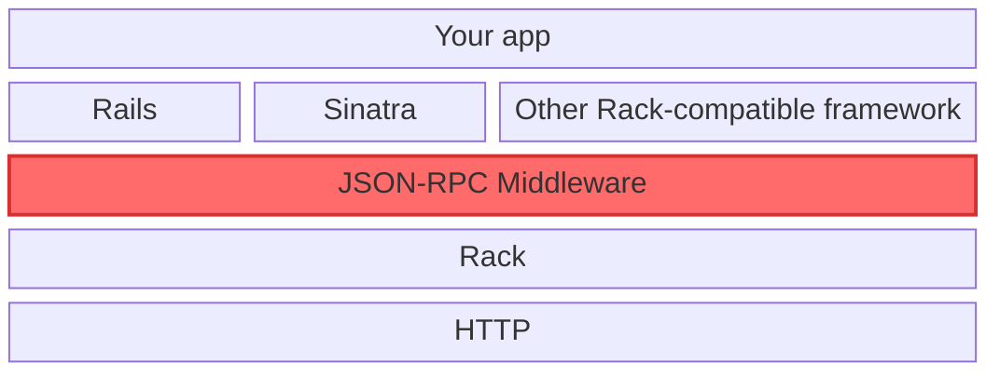

<p align="center">
  <a href="https://jsonrpc-middleware.com" target="_blank">
    <picture>
      <source media="(prefers-color-scheme: dark)" srcset="./.github/images/logo-dark.svg">
      <source media="(prefers-color-scheme: light)" srcset="./.github/images/logo-light.svg">
      
    </picture>
  </a>
</p>


<div align="center">

[](https://badge.fury.io/rb/jsonrpc-middleware)

[](https://qlty.sh/gh/wilsonsilva/projects/jsonrpc-middleware)
[](https://qlty.sh/gh/wilsonsilva/projects/jsonrpc-middleware)

</div>

A Rack middleware implementing the JSON-RPC 2.0 protocol that integrates easily with all Rack-based applications (Rails, Sinatra, Hanami, etc).

## Table of contents

- [Key features](#-key-features)
- [Installation](#-installation)
- [Quickstart](#-quickstart)
- [Examples](#-examples)
- [Documentation](#-documentation)
- [Development](#-development)
  * [Type checking](#-type-checking)
- [Contributing](#-contributing)
- [License](#-license)
- [Code of Conduct](#-code-of-conduct)

## 🔑 Key features

- **Spec-compliant**: Fully implements the [JSON-RPC 2.0 specification](https://www.jsonrpc.org/specification)
- **Rack middleware integration**: Seamlessly integrates with Rack applications (Rails, Sinatra, Hanami, etc)
- **Support for all request types**: Handles single requests, notifications, and batch requests
- **Error handling**: Comprehensive error handling with standard JSON-RPC error responses
- **Request validation**: Define request parameter specifications and validations
- **Helpers**: Convenient helper methods to simplify request and response processing

## 🏗️ Architecture

The gem integrates seamlessly into your Rack-based application:



## 📦 Installation

Install the gem and add to the application's Gemfile by executing:

    $ bundle add jsonrpc-middleware

If bundler is not being used to manage dependencies, install the gem by executing:

    $ gem install jsonrpc-middleware

## ⚡️ Quickstart

Create a file called `config.ru` and run `bundle exec rackup`:

```ruby
# frozen_string_literal: true

require 'bundler/inline'

gemfile do
  source 'https://rubygems.org'

  gem 'jsonrpc-middleware', require: 'jsonrpc'
  gem 'puma'
  gem 'rack'
  gem 'rackup'
end

JSONRPC.configure do
  procedure(:add, allow_positional_arguments: true) do
    params do
      required(:addends).filled(:array)
      required(:addends).value(:array).each(type?: Numeric)
    end

    rule(:addends) do
      key.failure('must contain at least one addend') if value.empty?
    end
  end
end

class App
  include JSONRPC::Helpers

  def call(env)
    @env = env

    if jsonrpc_request?
      result = handle_single(jsonrpc_request)
      jsonrpc_response(result)
    elsif jsonrpc_notification?
      handle_single(jsonrpc_notification)
      jsonrpc_notification_response
    else
      responses = handle_batch(jsonrpc_batch)
      jsonrpc_batch_response(responses)
    end
  end

  private

  def handle_single(request_or_notification)
    params = request_or_notification.params

    addends = params.is_a?(Array) ? params : params['addends'] # Handle positional and named arguments
    addends.sum
  end

  def handle_batch(batch)
    batch.flat_map do |request_or_notification|
      result = handle_single(request_or_notification)
      JSONRPC::Response.new(id: request_or_notification.id, result:) if request_or_notification.is_a?(JSONRPC::Request)
    end.compact
  end
end

use JSONRPC::Middleware
run App.new
```

This will give you a fully-featured Rack JSON-RPC server, capable of handling requests, notifications and batches,
validate the methods and parameter schema, and respond successfully or erroneously.

For more advanced setups, or other frameworks such as Rails or Sinatra, check the [examples](https://github.com/wilsonsilva/jsonrpc-middleware/blob/main/examples/README.md).

## 📚 Documentation

- [YARD documentation](https://rubydoc.info/gems/jsonrpc-middleware)

## 📜 Examples

Examples for the most common Rack-based applications, including Rails and Sinatra can be found [here](https://github.com/wilsonsilva/jsonrpc-middleware/blob/main/examples/README.md)

## 🔨 Development

After checking out the repo, run `bin/setup` to install dependencies.

To install this gem onto your local machine, run `bundle exec rake install`.

You can also run `bin/console` for an interactive prompt that will allow you to experiment.

To release a new version, update the version number in `version.rb`, and then run `bundle exec rake release`,
which will create a git tag for the version, push git commits and the created tag, and push the `.gem` file
to [rubygems.org](https://rubygems.org).

The health and maintainability of the codebase is ensured through a set of
Rake tasks to test, lint and audit the gem for security vulnerabilities and documentation:

```
rake build                    # Build jsonrpc-middleware.gem into the pkg directory
rake build:checksum           # Generate SHA512 checksum of jsonrpc-middleware.gem into the checksums directory
rake bundle:audit:check       # Checks the Gemfile.lock for insecure dependencies
rake bundle:audit:update      # Updates the bundler-audit vulnerability database
rake clean                    # Remove any temporary products
rake clobber                  # Remove any generated files
rake coverage                 # Run spec with coverage
rake install                  # Build and install jsonrpc-middleware.gem into system gems
rake install:local            # Build and install jsonrpc-middleware.gem into system gems without network access
rake qa                       # Test, lint and perform security and documentation audits
rake release[remote]          # Create tag v0.1.0 and build and push jsonrpc-middleware-0.1.0.gem to rubygems.org
rake rubocop                  # Run RuboCop
rake rubocop:autocorrect      # Autocorrect RuboCop offenses (only when it's safe)
rake rubocop:autocorrect_all  # Autocorrect RuboCop offenses (safe and unsafe)
rake spec                     # Run RSpec code examples
rake verify_measurements      # Verify that yardstick coverage is at least 100%
rake yard                     # Generate YARD Documentation
rake yard:format              # Format YARD documentation
rake yard:junk                # Check the junk in your YARD Documentation
rake yardstick_measure        # Measure docs in lib/**/*.rb with yardstick
```

### 🧪 Type checking

This gem leverages [RBS](https://github.com/ruby/rbs), a language to describe the structure of Ruby programs. It is
used to provide type checking and autocompletion in your editor. Run `bundle exec typeprof FILENAME` to generate
an RBS definition for the given Ruby file. And validate all definitions using [Steep](https://github.com/soutaro/steep)
with the command `bundle exec steep check`.

## 🐞 Issues & Bugs

If you find any issues or bugs, please report them [here](https://github.com/wilsonsilva/jsonrpc-middleware/issues), I will be happy
to have a look at them and fix them as soon as possible.

## 🤝 Contributing

Bug reports and pull requests are welcome on GitHub at https://github.com/wilsonsilva/jsonrpc-middleware.
This project is intended to be a safe, welcoming space for collaboration, and contributors are expected to adhere
to the [code of conduct](https://github.com/wilsonsilva/jsonrpc-middleware/blob/main/CODE_OF_CONDUCT.md).

## 📜 License

The gem is available as open source under the terms of the [MIT License](https://opensource.org/licenses/MIT).

## 👔 Code of Conduct

Everyone interacting in the JSONRPC::Middleware Ruby project's codebases, issue trackers, chat rooms and mailing lists is expected
to follow the [code of conduct](https://github.com/wilsonsilva/jsonrpc-middleware/blob/main/CODE_OF_CONDUCT.md).
